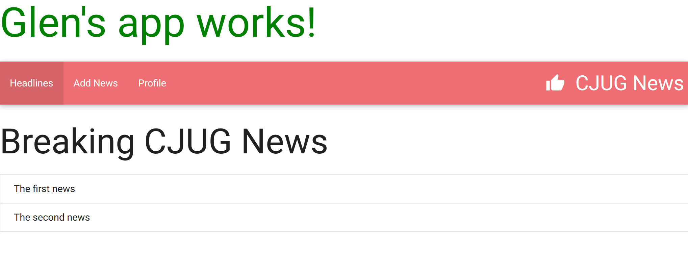

# CJUG Sample News Application

This was a small application that we developed during a [Canberra Java User Group](https://www.meetup.com/Canberra-Java-User-Group/) Meetup about [Angular 2.0](https://www.meetup.com/Canberra-Java-User-Group/events/233297712/).

If you'd like to get this running at home, first you'll need to:
* Download and Install a current [Node.js](https://nodejs.org/en/)
* Check into the project directory and type `npm install` 
* Run `npm install -g angular-cli` to get the [Angular CLI](https://cli.angular.io/)
* Run `ng serve` to run the application
* Point your browser at [localhost:4200](http://localhost:4200/news)

## YouTube Deep Dive

If you enjoyed this talk, you can subscribe to my [YouTube Channel](https://www.youtube.com/c/freshbytecode), and for specific Angular 2.0 stuff, checkout my [Learn Angular 2.0 in 21 Days for Java Devs](https://www.youtube.com/playlist?list=PLix-OafSjpFmq9K8eItC6bFSgz-732Rkn) playlist.

And if "too much Glen ain't enough", there's also tons of interesting stuff on my [blog](http://blogs.bytecode.com.au/glen/) and [twitter](https://www.youtube.com/c/freshbytecode).

## Screenshots

# The Standard Blurb you get with Angular CLI projects

This project was generated with [angular-cli](https://github.com/angular/angular-cli) version 1.0.0-beta.10.

## Development server
Run `ng serve` for a dev server. Navigate to `http://localhost:4200/`. The app will automatically reload if you change any of the source files.

## Code scaffolding

Run `ng generate component component-name` to generate a new component. You can also use `ng generate directive/pipe/service/route/class`.

## Build

Run `ng build` to build the project. The build artifacts will be stored in the `dist/` directory. Use the `-prod` flag for a production build.

## Running unit tests

Run `ng test` to execute the unit tests via [Karma](https://karma-runner.github.io).

## Running end-to-end tests

Run `ng e2e` to execute the end-to-end tests via [Protractor](http://www.protractortest.org/). 
Before running the tests make sure you are serving the app via `ng serve`.

## Deploying to Github Pages

Run `ng github-pages:deploy` to deploy to Github Pages.

## Further help

To get more help on the `angular-cli` use `ng --help` or go check out the [Angular-CLI README](https://github.com/angular/angular-cli/blob/master/README.md).
